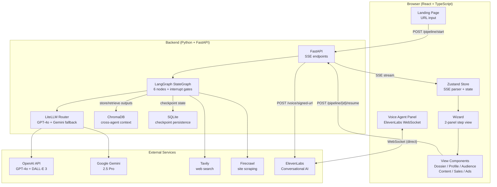
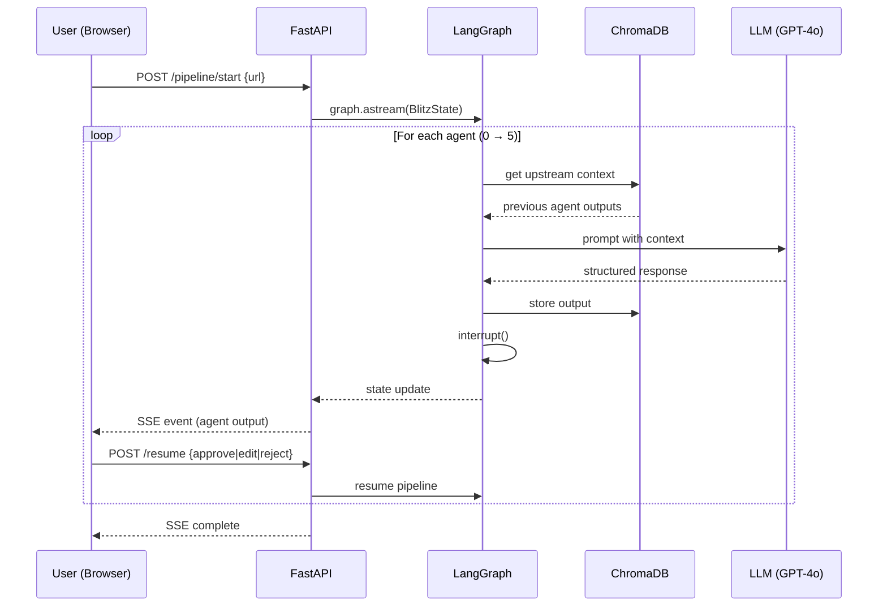
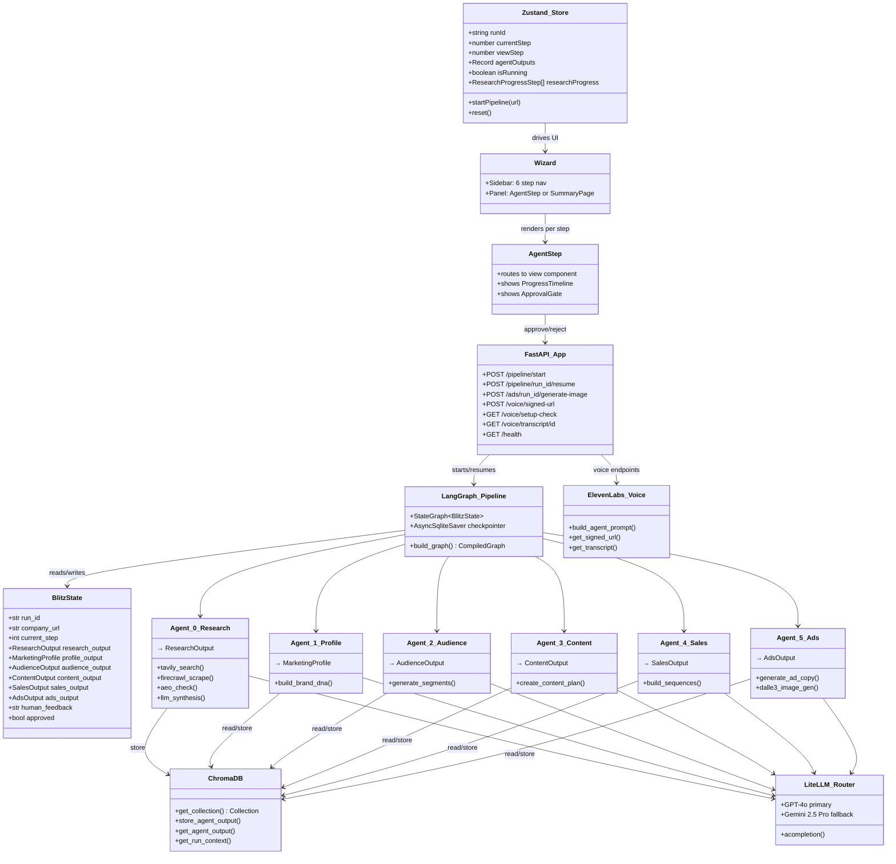

# Blitz

**Enter a company URL. Get a complete marketing pipeline.**

Blitz is a multi-agent AI marketing platform that transforms a single company URL into a full marketing package — research dossier, brand profile, audience segments, content strategy, sales outreach, and ad creatives — with human approval at every step.

Built as a working demo for the **Kana AI Solutions Builder** role (super{set} portfolio company).

---

## How It Works

A user pastes a company URL into the landing page. The backend spins up a LangGraph pipeline of 6 sequential AI agents, each building on the previous agent's output stored in ChromaDB. After each agent completes, the pipeline pauses (`interrupt()`) and streams the result to the browser via SSE. The user reviews the output and decides: **approve**, **edit**, **reject** (with feedback for re-generation), or **override**. Once approved, the next agent begins. The result is a complete, human-vetted marketing package generated from a single URL.

```
Company URL  ──→  6 AI Agents (sequential, human-gated)  ──→  Full Marketing Package
```

| Step | Agent | Output |
|------|-------|--------|
| 0 | **Research Scout** | Company dossier, press coverage, competitor profiles, AEO score |
| 1 | **Profile Creator** | Brand DNA, positioning, USPs, marketing gaps |
| 2 | **Audience Identifier** | 3-5 synthetic audience segments with demographics & psychographics |
| 3 | **Content Strategist** | Social posts, email campaigns, blog outlines, 30-day calendar |
| 4 | **Sales Agent** | Cold email sequences, LinkedIn DMs, lead scoring + optional voice agent |
| 5 | **Ad Creative Generator** | Google/Meta/LinkedIn ad copy, A/B variants + optional DALL-E 3 visuals |

---

## System Architecture



### Data Flow



---

## Code Structure



### Agent Module Pattern

Every agent (`agent_1` through `agent_5`) follows the same 4-file pattern:

```
agent_N_name/
├── node.py      # LangGraph node function — reads ChromaDB, calls LLM, stores output, returns state
├── schemas.py   # Pydantic models for structured output (e.g., MarketingProfile, AudienceOutput)
├── prompts.py   # System + user prompt templates
└── __init__.py
```

Agent 0 (Research) adds `research.py` (Tavily/Firecrawl/AEO logic) and `progress.py` (sub-step streaming).

---

## Kana Pillar Coverage

| Kana Pillar | Blitz Implementation |
|-------------|---------------------|
| Synthetic Data Enrichment | Audience segments with expanded synthetic lookalike profiles |
| AI-Powered Analytics | Research Scout + competitor analysis + AEO scoring |
| Answer Engine Optimization | Multi-LLM AEO check — "Is X a good choice in its space?" across GPT-4o and Gemini |
| Agentic Execution | 6-agent LangGraph pipeline with human-in-the-loop governance |

## Tech Stack

| Layer | Technology |
|-------|-----------|
| Orchestration | LangGraph (StateGraph + interrupt gates) |
| LLM Routing | LiteLLM Router (GPT-4o primary, Gemini 2.5 Pro fallback) |
| Vector DB | ChromaDB (cross-agent context sharing + audit trail) |
| Backend | Python, FastAPI, SSE streaming, Pydantic |
| Frontend | React, TypeScript, Vite, Tailwind CSS v4, Zustand, Headless UI |
| Research | Tavily API, Firecrawl |
| Voice | ElevenLabs Conversational AI via WebSocket (optional, browser-based) |
| Image Gen | DALL-E 3 via LiteLLM (user-triggered, 3/run cap) |

---

## Quick Start

### Prerequisites

- Python 3.11+
- Node.js 18+
- [uv](https://docs.astral.sh/uv/) (Python package manager)
- API keys: OpenAI, Gemini, Tavily, Firecrawl

### 1. Clone and set up backend

```bash
cd backend
cp .env.example .env
# Add your API keys to .env

uv sync                # or: pip install -r requirements.txt
uv run uvicorn main:app --host 0.0.0.0 --port 8000
```

### 2. Set up frontend

```bash
cd frontend
npm install
npm run dev
```

### 3. Open the app

Navigate to `http://localhost:5173`, enter a company URL, and watch the pipeline run.

### Demo Mode (no API keys needed)

```bash
# In frontend/
cp .env.demo .env.local
npm run dev
```

Replays the full 6-agent pipeline from cached fixture data. No live API calls.

---

## Key Architecture Decisions

- **AI-agnostic**: LiteLLM Router abstracts LLM providers. Swap models without code changes.
- **Sequential pipeline**: Each agent depends on the previous agent's output. ChromaDB provides cross-agent context sharing — any agent can read any upstream agent's output by `run_id`.
- **HITL governance**: LangGraph `interrupt()` pauses the pipeline after each agent. Users approve, edit, reject (re-generates with feedback), or override before advancing.
- **SSE streaming**: Real-time progress updates as each agent runs. The backend interleaves two async sources (research sub-step queue + graph state stream) into one SSE event stream. No polling.
- **Checkpoint persistence**: `AsyncSqliteSaver` persists pipeline state to `blitz.db`. The pipeline survives server restarts — resume mid-pipeline without re-running completed agents.
- **Demo mode**: `VITE_DEMO_MODE=cached` replays fixture JSON — eliminates API rate limit risk during live demos.

## Project Structure

```
superset/
├── backend/
│   ├── agents/
│   │   ├── agent_0_research/      # Tavily + Firecrawl + AEO + LLM synthesis
│   │   ├── agent_1_profile/       # Brand DNA + positioning
│   │   ├── agent_2_audience/      # Segments + synthetic expansion
│   │   ├── agent_3_content/       # Social, email, blog, calendar
│   │   ├── agent_4_sales/         # Sequences, DMs, lead scoring
│   │   ├── agent_5_ads/           # Ad copy + DALL-E 3 visuals
│   │   └── agent_voice/           # ElevenLabs browser voice agent
│   ├── main.py                    # FastAPI app + SSE endpoints
│   ├── graph.py                   # LangGraph pipeline definition
│   ├── llm.py                     # LiteLLM Router config
│   ├── state.py                   # BlitzState TypedDict
│   └── db.py                      # ChromaDB client
├── frontend/
│   └── src/
│       ├── components/            # React UI components
│       ├── pages/Landing.tsx      # URL input landing page
│       ├── store/useBlitzStore.ts # Zustand state + SSE parser
│       └── demo/                  # Cached fixture data for demo mode
```

## API Endpoints

| Method | Path | Description |
|--------|------|-------------|
| `POST` | `/pipeline/start` | Start pipeline (returns SSE stream) |
| `POST` | `/pipeline/{run_id}/resume` | Resume with human decision (approve/edit/reject/override) |
| `POST` | `/ads/{run_id}/generate-image` | Generate DALL-E 3 ad visual |
| `GET` | `/voice/setup-check` | Check ElevenLabs configuration |
| `POST` | `/voice/signed-url` | Get signed WebSocket URL for browser voice session |
| `GET` | `/voice/transcript/{id}` | Get conversation transcript |
| `GET` | `/health` | Health check |

## Environment Variables

```env
# Required
OPENAI_API_KEY=        # GPT-4o for content, sales, ads
GEMINI_API_KEY=        # Gemini 2.5 Pro fallback
TAVILY_API_KEY=        # Web search for Research Scout
FIRECRAWL_API_KEY=     # Website crawling

# Optional
ELEVENLABS_API_KEY=    # Voice agent
ELEVENLABS_AGENT_ID=   # Conversational AI agent ID
```

## What's Next

- **Parallel agent execution** — Fan-out agents with no data dependency (e.g., Content + Sales) to cut pipeline time
- **Feedback loop** — Let downstream agents flag weak upstream outputs and trigger targeted re-generation
- **Campaign export** — One-click export to CSV/PDF or direct push to platforms (HubSpot, Mailchimp, Meta Ads Manager)
- **Multi-run comparison** — Side-by-side diffs across pipeline runs to track how edits and feedback shift outputs
- **Persistent brand memory** — Store approved profiles and audience segments so repeat runs for the same company skip redundant work
- **Auth + multi-tenant** — User accounts with isolated pipeline histories and API key management

## License

Private project — built for interview demonstration.
